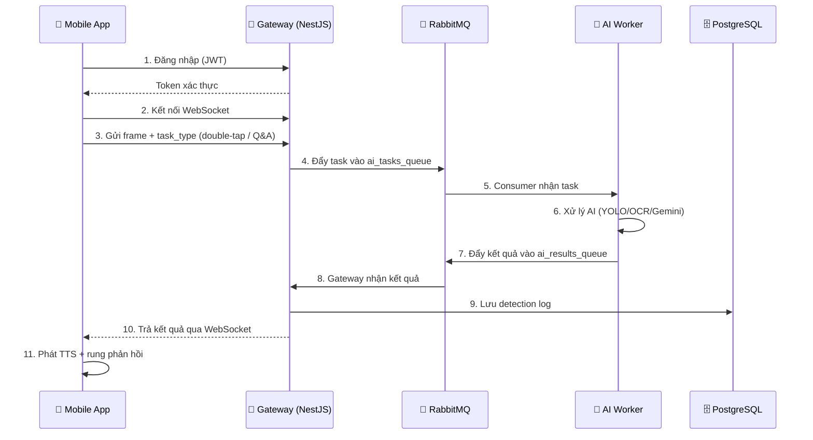

<div align="center">

# 👁️ AI Vision Assistant

### Hệ thống trợ lý thị giác thời gian thực cho người khiếm thị và người bị suy giảm thị lực

_Sử dụng AI để nhận diện vật thể, tiền Việt Nam, cảnh báo nguy hiểm, điều hướng GPS và phản hồi bằng giọng nói tiếng Việt_

<br/>


<br/>


[](https://github.com/Nguyen-Trung-Tien/AI_Vision_Assistant/actions/workflows/ci-cd.yml)

</div>

---

---

> [!WARNING]
> **⚠️ TRẠNG THÁI DỰ ÁN — Local Development (Đồ án tốt nghiệp)**
>
> Dự án đang trong giai đoạn **phát triển và nghiên cứu**, chưa sẵn sàng cho production.

> [!CAUTION]
> **🔒 Bảo mật**
>
> - File `.env` chứa API keys & mật khẩu — **KHÔNG commit lên public repo**. Luôn sử dụng `.env.example`.
> - `ADMIN_DEFAULT_PASSWORD` và `JWT_SECRET` mặc định chỉ dùng cho dev — **bắt buộc đổi** trước khi deploy.
> - `GEMINI_API_KEY` là secret — không hardcode vào source code.
> - WebSocket hiện chấp nhận `origin: '*'` — cần restrict trong production.

> [!WARNING]
> **🎯 Độ chính xác AI**
>
> - Hệ thống đang dùng các trọng số YOLOv11 nạp từ thư mục `ai-worker/models` hoặc biến môi trường cấu hình; loại model cụ thể có thể thay đổi theo môi trường triển khai.
> - Nhận diện tiền VN phụ thuộc điều kiện ánh sáng, góc chụp, độ mới của tờ tiền.
> - Ước lượng khoảng cách dựa trên **MiDaS Small (Depth Estimation)** và công thức hình học — sai số ±20%.
> - Hallucination Guard cảnh báo khi confidence < 85%, nhưng **không đảm bảo 100% chính xác**.
> - Visual Q&A (Gemini) phụ thuộc API bên ngoài — có thể thay đổi/ngừng hoạt động.

> [!IMPORTANT]
> **⚡ Hiệu suất & Hạn chế**
>
> - AI Worker hỗ trợ **continuous stream cho walking mode** (latest-only queue + smart throttle).
> - Continuous stream được tối ưu ở mức **1-5 FPS** tùy chuyển động và pin.
> - Một số tính năng **bắt buộc Internet**: điều hướng GPS (OSRM), Visual Q&A (Gemini), Smart OCR.
> - Face Recognition sử dụng InsightFace (Buffalo_L) — cần GPU để đạt performance tốt nhất.
> - TFLite offline fallback cần model `.tflite` riêng — chưa tự động convert từ YOLO.

> [!NOTE]
> **📋 Lưu ý sử dụng**
>
> - Dự án mang tính **nghiên cứu/học thuật** — **KHÔNG** thay thế hệ thống an toàn chuyên dụng cho người khiếm thị.
> - Cần test kỹ trên thiết bị thật (không chỉ emulator) để đánh giá trải nghiệm thực tế.
> - Dữ liệu GPS/vị trí người dùng được gửi qua WebSocket — cân nhắc privacy khi deploy.

---

## 📰 Cập nhật mới nhất

### 🗓️ Tháng 5/2026 — v2.1.1 (Current)

| Ngày      | Cập nhật                             | Mô tả                                                                                                                                                            |
| --------- | ------------------------------------ | ---------------------------------------------------------------------------------------------------------------------------------------------------------------- |
| **23/05** | 👤 Trang thông tin cá nhân (Profile) | Thêm chức năng xem và cập nhật thông tin cá nhân (Họ tên, Số điện thoại) trong phần Cài đặt của ứng dụng di động, tích hợp phản hồi giọng nói (accessibility). |

### 🗓️ Tháng 5/2026 — v2.0.0 🚀 Performance Milestone

| Ngày      | Cập nhật                        | Mô tả                                                                                                                                                      |
| --------- | ------------------------------- | ---------------------------------------------------------------------------------------------------------------------------------------------------------- |
| **21/05** | ⚡ F1: JPEG Quality Optimization | Giảm quality encode JPEG từ 95→75 cho Continuous Stream, tiết kiệm ~35% thời gian encode (~25ms/frame) — chất lượng vẫn đủ cho YOLO nhận diện chính xác   |
| **21/05** | ⚡ F2: Single-Pipeline Resize+Flip | Hợp nhất resize và flip ảnh front camera thành 1 chu kỳ encode/decode, loại bỏ double-encode tốn ~20-40ms/frame                                          |
| **21/05** | ⚡ F3: Async TTS Generation     | TTS giờ chạy qua `ThreadPoolExecutor` nền: cache hit trả về ngay, cache miss submit background — consumer thread không còn bị block ~500-3000ms/lần          |
| **21/05** | ⚡ F4: Non-blocking Debug Write  | `cv2.imwrite()` debug frame giờ chạy qua daemon thread — loại bỏ blocking I/O khỏi critical path AI (~5-20ms/frame)                                        |
| **21/05** | ⚡ F5: LRU-bounded Depth Cache  | `_depth_cache` từ plain dict → LRU `OrderedDict` giới hạn 200 entries, ngăn memory leak khi nhiều client đồng thời                                         |
| **21/05** | ⚡ F6: Throttled Stale Cleanup  | `_cleanup_stale_clients()` từ gọi mỗi request → throttle 60 giây/lần, loại bỏ O(n) scan không cần thiết                                                   |
| **21/05** | ⚡ F7: YOLO Inference Tuning    | Thêm `imgsz=480` (khớp resize), `device="cpu"` tường minh, `agnostic_nms=True` — giảm ~15-30ms/frame                                                      |
| **21/05** | ⚡ F8: Event-driven Task Queue  | Loại bỏ `setInterval(50ms)` busy-poll → xử lý task ngay khi `enqueueTask()` được gọi, giảm ~5% CPU overhead                                               |
| **21/05** | ⚡ F9: Conditional DB Write     | Bỏ qua ghi DB cho CONTINUOUS silent/empty results — chỉ persist khi có danger alert hoặc text thực sự, tiết kiệm **~70-80% DB writes**                     |
| **21/05** | ⚡ F10: In-flight Timeout Bump  | `CONTINUOUS_IN_FLIGHT_TIMEOUT_MS`: 2500→3500ms — tránh expire sớm gây double-processing khi AI worker tải cao                                              |

> **Tổng tác động v2.0.0:** ~70-100ms/frame latency giảm trên Continuous Stream + ~70-80% giảm DB writes

### 🗓️ Tháng 5/2026 — v1.9.4

| Ngày      | Cập nhật                   | Mô tả                                                                                                                                |
| --------- | -------------------------- | ------------------------------------------------------------------------------------------------------------------------------------ |
| **20/05** | 📱 TFLite Offline Money Fix | Tối ưu hóa ngoại tuyến: Sửa lỗi nạp mô hình TFLite offline (`best_float32.tflite`), tích hợp bộ lọc mệnh giá nghiêm ngặt (chỉ nhận diện 9 mệnh giá tiền Việt Nam từ 1.000đ đến 500.000đ khi offline), tự động định tuyến thông minh khi mất kết nối. |
| **15/05** | 🚨 SOS Status Overlay      | Nâng cấp thông báo SOS trên Mobile thành overlay đa trạng thái: `countdown` → `sending` → `sent/error`, thêm vòng đếm ngược, hướng dẫn hủy báo động giả và tự đóng sau khi hoàn tất |
| **13/05** | 📦 Recognition Overlay     | Bổ sung `RecognitionOverlay` cho chế độ nhận diện tổng hợp: hiển thị thẻ thông tin trên camera, highlight vật thể chính và vẽ bounding box trực tiếp trên preview |
| **13/05** | 🔗 Detection Payload Sync  | Đồng bộ dữ liệu detection end-to-end giữa AI Worker → Gateway → Mobile: thêm `raw_detections`, `primary_detection`, `frame_width`, `frame_height`, `recognition_title` |
| **13/05** | 💯 Confidence UX           | Chuẩn hóa cách đọc và hiển thị độ tin cậy theo phần trăm thân thiện hơn, ví dụ `90%` thay cho `0.9` trong nhận diện tiền |
| **12/05** | 📖 Enhanced File Reading   | Nâng cấp hiệu ứng đọc tệp: nền trang nhấp nháy (pulsing) và các dòng văn bản hoạt họa theo nhịp đọc của TTS, tăng tính tương tác     |
| **11/05** | 🔧 File Selection UX       | Tối ưu quy trình đọc tệp: chỉ hiển thị overlay xử lý sau khi đã chọn tệp thành công, tránh gây nhầm lẫn cho người dùng               |
| **10/05** | 📱 Layout Optimization     | Tối ưu bố cục Mobile: sắp xếp HUD đi bộ, cảnh báo nguy hiểm và các nút chức năng động, tránh chồng chéo trên mọi kích thước màn hình |
| **10/05** | ⚙️ Modern Settings         | Giao diện Cài đặt mới dạng thẻ (Card-based), phân loại khoa học, tối ưu hóa vùng chạm ngón cái (Thumb Zone) và dễ truy cập hơn       |
| **10/05** | 🎨 Mode Animations         | Animation riêng cho 7 chế độ AI (Money/Caption/Face/OCR/File/Layout) với CustomPaint và màu sắc khác biệt                            |
| **10/05** | 🔊 Speaking Overlay        | Hiệu ứng sóng âm waveform khi TTS đang đọc kết quả, overlay giữ nguyên cho đến khi đọc xong                                          |
| **10/05** | 🎯 Mode Color System       | Hệ thống màu riêng cho mỗi chế độ (Gold/Blue/Teal/Cyan/Orange/Green/Pink) trên carousel, icon và indicator dots                      |
| **07/05** | 🚨 SOS Success UI          | Cập nhật giao diện thông báo trạng thái "Đã gửi cảnh báo SOS" kèm tính năng đếm ngược 10 giây Hủy báo động giả trực quan trên Mobile |
| **01/05** | 📖 Layout Analysis         | Tích hợp Gemini-3-flash-preview cho phân tích bố cục menu, sách và tài liệu phức tạp, trả về cấu trúc chi tiết và đọc qua TTS              |
| **01/05** | 🚀 CI/CD Automation        | Thiết lập GitHub Actions tự động hóa quy trình Lint, Test và Build cho toàn bộ thành phần (Backend, AI, Admin, Mobile)               |
| **01/05** | 📱 Admin Dashboard PWA     | Chuyển đổi Admin Dashboard sang Progressive Web App (PWA), cho phép cài đặt và hoạt động ổn định trên nhiều thiết bị                 |
| **01/05** | 🛡️ Stability & Type Safety | Hoàn thiện dọn dẹp linting (flake8, ESLint) và thắt chặt kiểu dữ liệu (Strict Typing) cho toàn bộ hệ thống                           |

### 🗓️ Tháng 5/2026 — v1.8.0

### 🗓️ Tháng 5/2026 — v1.7.1

### 🗓️ Tháng 5/2026 — v1.7.0

### 🗓️ Tháng 4/2026 — v1.6.0

### 🗓️ Tháng 4/2026 — v1.5.0

| Ngày      | Cập nhật                        | Mô tả                                                                                                                                  |
| --------- | ------------------------------- | -------------------------------------------------------------------------------------------------------------------------------------- |
| **17/04** | 🧠 Face Registration (Alpha)    | Nhận diện người quen sử dụng InsightFace: phát hiện tên người đứng trước camera; thêm phản hồi giọng nói & rung khi đăng ký thành công |
| **17/04** | 📏 MiDaS Depth Estimation       | Tích hợp mô hình MiDaS Small cho ước lượng chiều sâu đơn mục, tăng độ chính xác khoảng cách                                            |
| **17/04** | 📄 Smart OCR (Gemini Vision)    | Chế độ đọc thông minh: phân tích biển báo, thực đơn (menu), hóa đơn bằng Gemini AI                                                     |
| **17/04** | 🔧 Fix OCR & File Reader        | Sửa lỗi OCR Offline (ML Kit), đồng bộ giọng nói chuyển mode, hỗ trợ đọc tệp .txt và tối ưu hóa trích xuất PDF                          |
| **15/04** | 📺 Visual Feedback              | Hiển thị Bounding Boxes + Object Chips trên mobile, tăng độ nhạy AI (480x480)                                                          |
| **15/04** | 🔊 Spatial Audio 3D             | Tích hợp âm thanh 3D: xác định hướng vật cản qua tai nghe stereo                                                                       |
| **08/04** | 🔧 Fix offline model            | Sửa lỗi mobile không nhận model TFLite offline đã có sẵn trên máy                                                                      |
| **04/04** | 🚨 Emergency Contact Network    | Tích hợp mạng lưới liên hệ khẩn cấp: gửi SMS qua backend đến liên hệ SOS và đẩy cảnh báo thời gian thực lên Admin Dashboard             |
| **04/04** | 🚶 Continuous Stream hoàn thiện | Walking Mode 3–5 FPS: adaptive FPS, latest-only queue, smart throttle, battery saving                                                  |

### 🗓️ Tháng 4/2026 — v1.4.0

| Ngày      | Cập nhật                        | Mô tả                                                                                 |
| --------- | ------------------------------- | ------------------------------------------------------------------------------------- |
| **15/04** | 📺 Visual Feedback              | Hiển thị Bounding Boxes + Object Chips trên mobile, tăng độ nhạy AI (480x480)         |
| **15/04** | 🔊 Spatial Audio 3D             | Tích hợp âm thanh 3D: xác định hướng vật cản qua tai nghe stereo                      |
| **08/04** | 🔧 Fix offline model            | Sửa lỗi mobile không nhận model TFLite offline đã có sẵn trên máy                     |
| **06/04** | 📦 Kaggle dataset               | Chuẩn bị và upload dataset lên Kaggle cho training model                              |
| **05/04** | 🚶 Continuous Stream fix        | Sửa lỗi UI đồng bộ ModeCarousel khi chuyển Walking Mode                               |
| **04/04** | 🚨 Emergency Contact Network    | Tích hợp mạng lưới liên hệ khẩn cấp: gửi SMS qua backend đến liên hệ SOS và đẩy cảnh báo thời gian thực lên Admin Dashboard |
| **04/04** | 🚶 Continuous Stream hoàn thiện | Walking Mode 3–5 FPS: adaptive FPS, latest-only queue, smart throttle, battery saving |
| **01/04** | 🛡️ System Integrity Audit       | Kiểm tra sức khỏe toàn bộ hệ thống, dọn dẹp code thừa                                 |

### 🗓️ Tháng 3/2026 — v1.2.0

| Ngày      | Cập nhật                  | Mô tả                                                                                   |
| --------- | ------------------------- | --------------------------------------------------------------------------------------- |
| **30/03** | 📝 README toàn diện       | Viết lại hoàn toàn README với kiến trúc, API docs, hướng dẫn chi tiết                   |
| **29/03** | 🚫 Loại bỏ mệnh giá nhỏ   | Xóa 200đ và 500đ khỏi dataset & constants (không còn lưu hành)                          |
| **28/03** | 🚦 Đèn giao thông         | Thêm 3 class: `traffic_light_red`, `traffic_light_yellow`, `traffic_light_green`        |
| **28/03** | 📊 Mở rộng 29 classes     | Thêm: motorbike, bus, plastic_bottle, glass_bottle, pothole, open_manhole, male, female |
| **28/03** | 📖 Đọc tài liệu PDF       | Thêm `document_reader_service.dart` hỗ trợ đọc file PDF bằng TTS                        |
| **28/03** | 🐛 Fix pika dependency    | Sửa lỗi `ModuleNotFoundError: No module named 'pika'`                                   |
| **27/03** | 🔤 Fix UTF-8 encoding     | Sửa lỗi hiển thị ký tự tiếng Việt bị lỗi trong `constants.py`                           |
| **27/03** | 🎓 YOLO Training pipeline | Hoàn thiện pipeline training: Roboflow → merge → Colab → deploy                         |

### 🗓️ Tháng 2/2026 — v1.0.0 → v1.1.0

| Ngày      | Cập nhật                   | Mô tả                                                                       |
| --------- | -------------------------- | --------------------------------------------------------------------------- |
| **27/02** | 🧹 Security hardening      | Loại bỏ hardcoded secrets, thêm sanitize TTS, cải thiện bảo mật             |
| **27/02** | 🗺️ OpenStreetMap migration | Chuyển navigation sang OSM API + FlutterMap (thay thế Google Maps)          |
| **26/02** | 🤖 Visual Q&A launch       | Tích hợp Gemini Vision API cho hỏi đáp bằng giọng nói qua ảnh               |
| **26/02** | 📊 Admin Dashboard v2      | Dashboard mới: SOS real-time, Heatmap, Feedback, Broadcast, User management |
| **25/02** | 👥 User management         | Thêm quản lý người dùng, sessions, broadcast TTS                            |
| **25/02** | 🔐 JWT + Cookie auth       | Hệ thống xác thực hoàn chỉnh: JWT token + cookie + WS guard                 |
| **25/02** | 🚨 SOS & Danger alerts     | Hệ thống SOS khẩn cấp + cảnh báo nguy hiểm real-time                        |
| **25/02** | 🗣️ TTS Cache (Redis)       | Cache audio TTS qua Redis, giảm latency phát giọng nói                      |
| **25/02** | 🎤 Voice commands          | Điều khiển app bằng giọng nói (Speech-to-Text)                              |

### 🗓️ v0.x — Foundation

- ✅ Khởi tạo cấu trúc monorepo: mobile_app + backend-gateway + ai-worker
- ✅ YOLO detection pipeline + RabbitMQ message queue
- ✅ OCR (Tesseract) + ML Kit (offline) barcode/text
- ✅ Scene captioning với spatial awareness (trái/giữa/phải)
- ✅ Nhận diện tiền Việt Nam (color validation + landmark features)
- ✅ TFLite on-device inference fallback
- ✅ Camera integration + accessibility (TTS + haptic)

---

## 🚀 Các tính năng nổi bật vừa cập nhật (v2.0.0)

Phiên bản v2.0.0 là **Performance Milestone** — tập trung hoàn toàn vào tối ưu hiệu suất hệ thống end-to-end (AI Worker + Backend Gateway), mang lại trải nghiệm Continuous Stream mượt mà hơn đáng kể:

1. **⚡ Single-Pipeline Frame Processing (F1+F2)**:
   - Hợp nhất resize + flip front camera vào **1 chu kỳ encode duy nhất** (trước: 2 lần encode/decode)
   - Giảm JPEG quality từ 95→75 cho continuous stream (chất lượng đủ cho YOLO, tiết kiệm 35% encode time)
   - Tổng tiết kiệm: **~45ms/frame**

2. **⚡ Async TTS — Không còn blocking (F3)**:
   - TTS generation giờ chạy trong `ThreadPoolExecutor` nền
   - Consumer thread không bị block bởi `subprocess.run(edge-tts)` (~500-3000ms trước đây)
   - Cache hit (Redis/LRU) vẫn trả về ngay, cache miss fire-and-forget

3. **⚡ Non-blocking Debug I/O (F4)**:
   - `cv2.imwrite()` chạy qua daemon thread riêng
   - Loại bỏ blocking disk I/O khỏi critical AI pipeline

4. **⚡ Memory Safety — LRU Depth Cache (F5)**:
   - Depth map cache giới hạn 200 entries với LRU eviction
   - Ngăn memory drift khi nhiều clients kết nối đồng thời

5. **⚡ CPU Efficiency (F6+F8)**:
   - Stale client cleanup throttle 60s/lần (thay vì mỗi request)
   - Loại bỏ `setInterval(50ms)` polling — task xử lý event-driven

6. **⚡ YOLO Inference Tuning (F7)**:
   - `imgsz=480` khớp với resize resolution (tránh internal re-resize)
   - `device="cpu"` tường minh + `agnostic_nms=True`

7. **⚡ Database Write Optimization (F9+F10)**:
   - Skip DB write cho CONTINUOUS silent frames → **~70-80% ít DB writes hơn**
   - In-flight timeout tăng 2500→3500ms cho stability khi tải cao


1.  **📱 TFLite Offline Money Fix (Mới)**:
    - Sửa lỗi nạp mô hình TFLite ngoại tuyến do sai đường dẫn asset, chuyển thành công sang đường dẫn `assets/models/money/best_float32.tflite`.
    - Tích hợp bộ lọc mệnh giá tiền cực kỳ nghiêm ngặt: khi chạy ngoại tuyến, chỉ tính điểm cho 9 mệnh giá tiền mục tiêu (`1000` - `500000`), bỏ qua toàn bộ vật thể thông thường (cột điện, ổ gà, rào chắn,...) và trả về phản hồi mặc định tiếng Việt `"Không nhận diện rõ đối tượng."`.
    - Thiết lập cơ chế tự động định tuyến thông minh sang `detectMoneyOffline()` khi nhấn đúp màn hình ở trạng thái không có kết nối internet (`isConnected == false`).

2.  **📦 Recognition Overlay**:
    - Hiển thị thẻ thông tin ngay trên camera khi phát hiện vật thể trong chế độ nhận diện tổng hợp.
    - Tự động chọn vật thể chính để highlight và giữ thông tin trực quan hơn cho người dùng.
    - Vẽ bounding box trực tiếp trên preview để người dùng biết AI đang nhận diện đúng vật thể nào.

3.  **🔗 Detection Payload End-to-End**:
    - AI Worker nay trả thêm `raw_detections`, `primary_detection`, `frame_width`, `frame_height`, `recognition_title`.
    - Backend Gateway forward nguyên các trường detection cần thiết về mobile app qua `ai_result`.
    - Mobile dùng cùng một nguồn dữ liệu để dựng card thông tin và box nhận diện.

4.  **💯 Confidence Display Improvement**:
    - Câu đọc và text nhận diện tiền đổi sang định dạng phần trăm dễ hiểu hơn, ví dụ `90%`.
    - Vẫn giữ `confidence_score` nội bộ dạng số thực để không ảnh hưởng thống kê và logic hệ thống.

5.  **🚨 SOS Status Overlay Upgrade**:
    - Thay màn hình “đã gửi SOS” đơn giản bằng luồng trạng thái đầy đủ: `countdown`, `sending`, `sent`, `error`.
    - Bổ sung vòng đếm ngược trực quan, vùng hướng dẫn rõ ràng và nút **Hủy báo động giả** nổi bật hơn trên mobile.
    - Overlay tự đóng sau khi gửi xong hoặc khi lỗi lấy vị trí, giúp trải nghiệm SOS mạch lạc hơn.

6.  **🧼 Overlay State Management**:
    - Tự động xóa recognition overlay khi rời khỏi chế độ nhận diện tổng hợp hoặc khi không còn detection hợp lệ.
    - Có fallback từ `boxes` sang detection card để UI vẫn hoạt động khi payload chỉ có bounding boxes.

7.  **🧭 Nền tảng cho bước nâng cấp tiếp theo**:
    - Sẵn sàng mở rộng thêm metadata cho QR, sản phẩm và tinh chỉnh box theo `front camera` hoặc `BoxFit.cover`.

8.  **📱 Vẫn giữ nguyên nền UX trước đó**:
    - Các cải tiến gần đây như HUD động, speaking overlay, file reading animation và mode color system vẫn được giữ nguyên trong bản vá này.
---

## 📖 Mục lục

- [Giới thiệu](#-giới-thiệu)
- [Tính năng chính](#-tính-năng-chính)
- [Các tính năng vừa cập nhật](#-các-tính-năng-nổi-bật-vừa-cập-nhật-v200)
- [Kiến trúc hệ thống](#-kiến-trúc-hệ-thống)
- [Luồng xử lý chính](#-luồng-xử-lý-chính)
- [Các chế độ trên Mobile App](#-các-chế-độ-trên-mobile-app)
- [Cấu trúc thư mục](#-cấu-trúc-thư-mục)
- [Yêu cầu môi trường](#-yêu-cầu-môi-trường)
- [Hướng dẫn cài đặt & chạy](#-hướng-dẫn-cài-đặt--chạy)
- [Biến môi trường](#-biến-môi-trường)
- [API Endpoints & WebSocket Events](#-api-endpoints--websocket-events)
- [Dataset & Training YOLO](#-dataset--training-yolo)
- [Admin Dashboard](#-admin-dashboard)
- [Cập nhật mới nhất](#-cập-nhật-mới-nhất)
- [Roadmap](#-roadmap)
- [Tác giả & Liên hệ](#-tác-giả--liên-hệ)

---

## 🌟 Giới thiệu

**AI Vision Assistant** là hệ thống trợ lý thị giác thời gian thực, được thiết kế để hỗ trợ **người khiếm thị và người bị suy giảm thị lực** sử dụng camera điện thoại để "nhìn" thế giới xung quanh. Hệ thống bao gồm 4 thành phần chính:

| #   | Thành phần             | Công nghệ                          | Mô tả                                                                               |
| --- | ---------------------- | ---------------------------------- | ----------------------------------------------------------------------------------- |
| 1   | **📱 Mobile App**      | Flutter, Camera, TTS, GPS          | Ứng dụng cho người dùng cuối — chụp ảnh, nhận kết quả AI, phát giọng nói tiếng Việt |
| 2   | **🔗 Backend Gateway** | NestJS, PostgreSQL, RabbitMQ       | API server trung tâm — xác thực JWT, tiếp nhận WebSocket, quản lý message queue     |
| 3   | **🧠 AI Worker**       | Python, FastAPI, YOLO, OCR, Gemini | Xử lý AI — nhận diện vật thể, tiền, mô tả cảnh và các tác vụ Gemini theo cấu hình   |
| 4   | **📊 Admin Dashboard** | React 19, Vite, Tailwind CSS v4    | Bảng quản trị — thống kê, SOS, heatmap nguy hiểm, feedback AI, broadcast TTS        |

---

## ✅ Tính năng chính

### 🔍 Nhận diện AI

| Tính năng               | Mô tả                                                                        | Xử lý                                         |
| ----------------------- | ---------------------------------------------------------------------------- | --------------------------------------------- |
| **Nhận diện vật thể**   | 13 lớp đối tượng đường phố chính: người, cầu thang, ổ gà, nắp cống, rào chắn, vạch qua đường, xe... | YOLO v11 (online) + TFLite (offline fallback khi có model) |
| **Nhận diện tiền VN**   | 9 mệnh giá: 1K → 500K VNĐ, kèm xác minh màu sắc HSV & đặc trưng landmark     | YOLO + color validation + OCR                 |
| **Đọc văn bản (OCR)**   | Đọc nhãn mác, biển báo, tài liệu (General/Smart Mode)                        | Tesseract + Gemini Vision (Smart OCR)         |
| **Mô tả cảnh**          | Mô tả không gian: vị trí trái/giữa/phải, ước lượng khoảng cách, gợi ý lối đi | YOLO + spatial analysis + MiDaS Depth         |
| **Visual Q&A**          | Luồng hỏi đáp ảnh đã có ở mức giao thiết mobile/gateway; cần hoàn thiện đầy đủ ở worker để ổn định | Google Gemini Vision API |
| **Nhận diện khuôn mặt** | Nhận diện người quen, bạn bè đã đăng ký                                      | InsightFace (Buffalo_L)                       |

### 🛡️ An toàn & Hỗ trợ

| Tính năng              | Mô tả                                                                                 |
| ---------------------- | ------------------------------------------------------------------------------------- |
| **Cảnh báo nguy hiểm** | Phát hiện vật cản gần (xe, ổ gà, nắp cống, cầu thang) + cảnh báo khoảng cách, vị trí  |
| **SOS khẩn cấp**       | Giữ màn hình/phím cứng → gửi SOS kèm GPS + ảnh đến admin dashboard                    |
| **Điều hướng GPS**     | GPS + la bàn + bản đồ OSM/OSRM → hướng dẫn đi bộ bằng giọng nói tiếng Việt            |
| **Flash tự động**      | Cảm biến ánh sáng tự bật/tắt đèn flash camera                                         |
| **Rung phản hồi**      | Haptic feedback theo loại sự kiện (nguy hiểm, xác nhận tiền, SOS)                     |
| **Continuous Stream**  | Chế độ đi bộ 3–5 FPS: phân tích liên tục, adaptive FPS, tiết kiệm pin                 |
| **Liên hệ khẩn cấp**   | CRUD danh bạ khẩn cấp; backend gửi SMS tới liên hệ SOS khi có cảnh báo từ người dùng |
| **Visual Feedback**    | Hiển thị khung bao (Bounding Boxes) + nhãn vật thể thời gian thực trên camera preview |
| **Spatial Audio 3D**   | Cảnh báo vật cản theo hướng (Trái/Phải/Giữa) qua tai nghe stereo theo thời gian thực  |

### 🗣️ Text-to-Speech

| Tính năng               | Mô tả                                                         |
| ----------------------- | ------------------------------------------------------------- |
| **TTS đa ngữ**          | Hỗ trợ tiếng Việt (`vi`) và tiếng Anh (`en`)                  |
| **Hallucination Guard** | Thêm cảnh báo "có thể là" / "hình ảnh mờ" khi confidence thấp |
| **TTS Cache**           | Redis cache audio → giảm latency cho các phát ngôn lặp lại    |
| **Sanitize markdown**   | Loại bỏ ký tự markdown trước khi phát qua TTS                 |

---

## 🧭 Kiến trúc hệ thống

```
┌─────────────────────────────────────────────────────────────────────┐
│                        MOBILE APP (Flutter)                         │
│  Camera → Frame capture → WebSocket → TTS / Vibration / GPS/Map     │
└──────────────────────────────┬──────────────────────────────────────┘
                               │ WebSocket (Socket.IO)
                               ▼
┌──────────────────────────────────────────────────────────────────────┐
│                     BACKEND GATEWAY (NestJS)                         │
│                                                                      │
│  ┌──────────┐ ┌────────────┐ ┌──────────┐ ┌──────────┐ ┌─────────┐   │
│  │   Auth   │ │   Vision   │ │   SOS    │ │ Feedback │ │Broadcast│   │
│  │ (JWT+WS) │ │ (WS+Queue) │ │ (Alerts) │ │ (Review) │ │  (TTS)  │   │
│  └──────────┘ └─────┬──────┘ └──────────┘ └──────────┘ └─────────┘   │
│                     │                                                │
│              ┌──────┴──────┐         ┌───────────────┐               │
│              │  RabbitMQ   │         │  PostgreSQL   │               │
│              │ (Task Queue)│         │  (Data Store) │               │
│              └──────┬──────┘         └───────────────┘               │
└─────────────────────┼────────────────────────────────────────────────┘
                      │ AMQP (ai_tasks_queue ↔ ai_results_queue)
                      ▼
┌──────────────────────────────────────────────────────────────────────┐
│                      AI WORKER (Python/FastAPI)                      │
│                                                                      │
│  ┌──────────────┐ ┌──────────────┐ ┌─────────────┐ ┌─────────────┐   │
│  │ YOLO v11     │ │ Money        │ │ Scene       │ │ Gemini      │   │
│  │ (Detection)  │ │ Detector     │ │ Captioner   │ │ Vision Q&A  │   │
│  └──────────────┘ └──────────────┘ └─────────────┘ └─────────────┘   │
│  ┌──────────────┐ ┌──────────────┐ ┌─────────────┐ ┌─────────────┐   │
│  │ Smart OCR    │ │ Face         │ │ Depth       │ │ Stabilizer  │   │
│  │ (Gemini)     │ │ Recognition  │ │ Estimator   │ │ (Temporal)  │   │
│  └──────────────┘ └──────────────┘ └─────────────┘ └─────────────┘   │
└──────────────────────────────────────────────────────────────────────┘

┌──────────────────────────────────────────────────────────────────────┐
│                   ADMIN DASHBOARD (React + Vite)                     │
│                                                                      │
│   Dashboard │ SOS Alerts │ Heatmap │ Feedback │ Broadcast │ Users    │
└──────────────────────────────────────────────────────────────────────┘
```

---

## 🔁 Luồng xử lý chính



### Chi tiết xử lý theo `task_type`

| Task Type            | Trigger hiện tại                     | AI Service                                        | Kết quả                                                          | TTS       |
| -------------------- | ------------------------------------ | ------------------------------------------------- | ---------------------------------------------------------------- | --------- |
| `OCR`                | Nhấn đúp ở mode 0                    | YOLO object + money detector                      | Nhận diện tổng hợp, có thể trả về vật thể hoặc mệnh giá tiền     | ✅ Server |
| `CAPTION`            | Nhấn đúp ở mode 1 hoặc Walking Mode  | YOLO + Scene Captioner + Danger Detector + MiDaS | Mô tả không gian, khoảng cách gần đúng và cảnh báo nguy hiểm     | ✅ Server |
| `FACE_RECOGNITION`   | Nhấn đúp ở mode 2 hoặc stream phụ    | InsightFace                                       | Nhận diện người quen đã đăng ký                                  | ✅ Server |
| `TEXT_OCR`           | Nhấn đúp ở mode 4                    | Tesseract OCR                                     | Văn bản trích xuất từ ảnh camera                                 | ✅ Server |
| `SMART_OCR`          | Lệnh giọng nói theo ngữ cảnh         | Gemini Vision                                     | Đọc hiểu menu, biển báo, hóa đơn theo ngữ cảnh                   | ✅ Server |
| `LAYOUT_ANALYSIS`    | Nhấn đúp ở mode 7                    | Gemini Vision                                     | Phân tích bố cục tài liệu/trang                                  | ✅ Server |
| `visual_qa`          | Nút Q&A                              | Luồng socket đã có, cần hoàn thiện worker riêng   | Tác vụ hỏi đáp trực quan đang ở trạng thái tích hợp/chưa ổn định | ⚠️ Khác nhau theo build |

---

## 📱 Các chế độ trên Mobile App

| Chế độ         | Tên              | Màu       | Mô tả                                               | Online/Offline |
| -------------- | ---------------- | --------- | --------------------------------------------------- | -------------- |
| **Mode 0**     | Nhận diện tổng hợp | 🟡 Gold | Nhận diện vật thể và tiền VNĐ; có thể chạy offline nếu máy có model TFLite | Both    |
| **Mode 1**     | Mô tả không gian   | 🔵 Blue | Mô tả cảnh, vật cản, khoảng cách gần đúng và cảnh báo nguy hiểm             | Online  |
| **Mode 2**     | Nhận diện người    | 🩵 Teal | Nhận diện người quen đã đăng ký                                                  | Online  |
| **Mode 3**     | Chỉ hướng          | 💜 Purple | GPS + la bàn + chỉ đường OSRM/OSM                                              | Online  |
| **Mode 4**     | Đọc văn bản (Online) | 🔹 Cyan | OCR ảnh qua server; Smart OCR là nhánh tác vụ riêng dùng Gemini               | Online  |
| **Mode 5**     | Đọc tệp            | 🟠 Orange | Đọc PDF, TXT, DOC, DOCX, ảnh từ bộ nhớ máy                                     | Offline |
| **Mode 6**     | Đọc chữ nhanh (Offline) | 🟢 Green | ML Kit Text Recognition + Barcode Scanner                                  | Offline |
| **Mode 7**     | Phân tích bố cục   | 🩷 Pink | Phân tích bố cục trang/tài liệu bằng Gemini                                    | Online  |
| **Visual Q&A** | Hỏi đáp          | —         | Hỏi đáp trực quan bằng giọng nói (Gemini AI)        | Online         |

> `Walking Mode` hiện là chế độ stream liên tục 3-5 FPS bật/tắt trong màn hình chính, không phải một ô riêng trên carousel mode.

> [!NOTE]
> Xem hướng dẫn chi tiết tại [`ai-worker/COLAB_TRAINING.md`](ai-worker/COLAB_TRAINING.md).

---

## 📊 Admin Dashboard

Dashboard quản trị cung cấp các trang:

| Trang            | Chức năng                                                    |
| ---------------- | ------------------------------------------------------------ |
| **Dashboard**    | Tổng quan: số detection, SOS, users online, biểu đồ thống kê |
| **SOS Khẩn Cấp** | Danh sách cảnh báo SOS real-time, GPS, ảnh đính kèm, resolve |
| **Heatmap**      | Bản đồ nhiệt vùng nguy hiểm (Leaflet + heatmap layer)        |
| **Feedback AI**  | Review phản hồi người dùng về kết quả AI (đúng/sai)          |
| **Broadcast**    | Gửi thông báo TTS đến tất cả users đang online               |
| **Người dùng**   | Quản lý tài khoản, phân quyền RBAC (Admin/User), thống kê    |
| **Analytics**    | Phân tích độ chính xác AI, xu hướng và giờ cao điểm          |
| **Hệ thống**     | Giám sát tài nguyên (CPU, RAM, DB), Audit Logs (Nhật ký)     |
| **AI Models**    | Quản lý và chuyển đổi các mô hình AI (Model Manager)         |

### Tính năng nổi bật

- **Real-time updates** qua Socket.IO
- **Responsive design** — hoạt động trên mobile và desktop
- **Dark theme** mặc định
- **Charts** sử dụng Recharts (Line, Pie)
- **Map** sử dụng React-Leaflet + leaflet.heat

---

## 📌 Roadmap

### Đã hoàn thành (v2.0.0)

- [x] TFLite Offline Money Fix: Sửa lỗi nạp mô hình offline, giới hạn nhận diện 9 mệnh giá tiền Việt Nam khi không có Internet, tự động định tuyến thông minh.
- [x] Recognition Overlay cho chế độ nhận diện tổng hợp: card thông tin + bounding box trên camera preview
- [x] Đồng bộ detection payload AI Worker → Gateway → Mobile với `raw_detections`, `primary_detection`, `frame_width`, `frame_height`
- [x] Chuẩn hóa cách đọc và hiển thị confidence theo phần trăm cho nhận diện tiền
- [x] Nâng cấp **SOS Status Overlay** trên Mobile: đếm ngược trực quan, trạng thái gửi vị trí và thông báo thành công/lỗi tự đóng
- [x] **Enhanced File Reading** — Animation trang giấy và dòng văn bản đồng bộ với TTS
- [x] **File Selection UX** — Tối ưu hóa thời điểm hiển thị overlay xử lý tệp
- [x] **Mode-Specific Animations** — 7 animation CustomPaint riêng cho mỗi chế độ AI
- [x] **Speaking Overlay** — Waveform khi TTS đọc kết quả, overlay giữ đến khi hoàn tất
- [x] **Mode Color System** — Hệ thống 7 màu riêng trên carousel, icon, dots
- [x] Smart OCR nâng cao (dịch thuật trực tiếp nội dung biển báo)
- [x] Offline-First Mode hoàn chỉnh (auto-switch online/offline)
- [x] Cloud deployment (Docker Compose full stack)
- [x] Offline model auto-update (OTA)
- [x] Nhận diện khuôn mặt người quen (Face Recognition với InsightFace)
- [x] Ước lượng chiều sâu đơn mục (Monocular Depth Estimation với MiDaS)
- [x] Chế độ OCR thông minh (Smart OCR: biển báo, menu, hóa đơn qua Gemini)
- [x] Stream liên tục 3–5 FPS cho chế độ đi bộ (walking mode + adaptive FPS)
- [x] Mạng lưới liên hệ khẩn cấp (backend gửi SMS và phát cảnh báo SOS real-time)
- [x] Âm thanh không gian 3D (trái/phải) theo vị trí vật cản
- [x] Visual Feedback (Bounding Boxes + Object Labels) trên preview
- [x] Admin Dashboard mở rộng (System Monitor, Analytics, RBAC, Activity Log)
- [x] Layout analysis (đọc menu/sách) bằng Gemini-3-flash-preview
- [x] CI/CD pipeline tự động hóa (GitHub Actions)
- [x] Progressive Web App cho Admin Dashboard

### Kế hoạch tương lai

- [ ] Tích hợp mô hình ngôn ngữ lớn (LLM) cho hội thoại tư vấn offline

---

## 🛠️ Tech Stack chi tiết

<details>
<summary><b>📱 Mobile App</b></summary>

| Package                         | Phiên bản | Mục đích                    |
| ------------------------------- | --------- | --------------------------- |
| `flutter`                       | SDK ^3.10 | Framework chính             |
| `camera`                        | ^0.11.4   | Camera capture              |
| `flutter_tts`                   | ^4.2.5    | Text-to-Speech              |
| `socket_io_client`              | ^3.1.4    | WebSocket real-time         |
| `geolocator`                    | ^14.0.2   | GPS location                |
| `flutter_compass`               | ^0.8.1    | La bàn điều hướng           |
| `flutter_map`                   | ^7.0.2    | Bản đồ OpenStreetMap        |
| `google_mlkit_text_recognition` | ^0.15.1   | OCR offline                 |
| `google_mlkit_barcode_scanning` | ^0.14.2   | Barcode/QR offline          |
| `speech_to_text`                | ^7.3.0    | Voice commands              |
| `tflite_flutter`                | ^0.11.0   | On-device AI inference      |
| `vibration`                     | ^3.1.7    | Haptic feedback             |
| `permission_handler`            | ^12.0.1   | Quản lý permissions         |
| `shared_preferences`            | ^2.3.3    | Local storage               |
| `syncfusion_flutter_pdf`        | ^33.1.45  | Đọc tài liệu PDF            |
| `flutter_contacts`              | ^1.1.9    | Liên hệ SOS                 |
| `battery_plus`                  | ^7.0.0    | Theo dõi pin (adaptive FPS) |

</details>

<details>
<summary><b>🔗 Backend Gateway</b></summary>

| Package                      | Phiên bản | Mục đích                |
| ---------------------------- | --------- | ----------------------- |
| `@nestjs/core`               | ^11.0.1   | Framework chính         |
| `@nestjs/websockets`         | ^11.1.14  | WebSocket server        |
| `@nestjs/platform-socket.io` | ^11.1.14  | Socket.IO adapter       |
| `@nestjs/typeorm`            | ^11.0.0   | ORM (PostgreSQL)        |
| `@nestjs/jwt`                | ^11.0.2   | JWT authentication      |
| `@nestjs/passport`           | ^11.0.5   | Passport.js integration |
| `@nestjs/microservices`      | ^11.1.14  | RabbitMQ integration    |
| `amqp-connection-manager`    | ^5.0.0    | AMQP connection pool    |
| `bcrypt`                     | ^6.0.0    | Password hashing        |
| `class-validator`            | ^0.14.3   | DTO validation          |
| `pg`                         | ^8.18.0   | PostgreSQL driver       |

</details>

<details>
<summary><b>🧠 AI Worker</b></summary>

| Package         | Phiên bản | Mục đích                            |
| --------------- | --------- | ----------------------------------- |
| `fastapi`       | ≥0.104.1  | HTTP server (health + static files) |
| `uvicorn`       | ≥0.24.0   | ASGI server                         |
| `pika`          | ≥1.3.2    | RabbitMQ client                     |
| `redis`         | ≥5.0.1    | TTS cache                           |
| `ultralytics`   | ≥8.0.0    | YOLO v11 inference                  |
| `opencv-python` | ≥4.8.0    | Image processing                    |
| `numpy`         | ≥1.24.0   | Numerical operations                |
| `pytesseract`   | ≥0.3.10   | OCR engine                          |
| `google-genai`  | ≥1.0.0    | Google Gemini Vision API            |
| `python-dotenv` | ≥1.0.0    | Environment variables               |

</details>

<details>
<summary><b>📊 Admin Dashboard</b></summary>

| Package            | Phiên bản | Mục đích                |
| ------------------ | --------- | ----------------------- |
| `react`            | ^19.0.0   | UI framework            |
| `react-dom`        | ^19.0.0   | React DOM renderer      |
| `vite`             | ^6.0.0    | Build tool + dev server |
| `tailwindcss`      | ^4.0.0    | CSS framework           |
| `recharts`         | ^2.15.0   | Charts (Line, Pie)      |
| `react-leaflet`    | ^5.0.0    | Map component           |
| `leaflet`          | ^1.9.4    | Map engine              |
| `leaflet.heat`     | ^0.2.0    | Heatmap layer           |
| `socket.io-client` | ^4.8.3    | Real-time WebSocket     |

</details>

---

## 👨‍💻 Tác giả & Liên hệ

<div align="center">

### **Nguyễn Trung Tiến**

[](mailto:2251120447@ut.edu.vn)
[](mailto:trungtiennguyen910@gmail.com)
[](https://github.com/Nguyen-Trung-Tien)

_Đồ án tốt nghiệp — Đại học Giao thông Vận tải TP. Hồ Chí Minh (UTH)_

</div>

---

**⭐ Nếu dự án hữu ích, hãy cho một star trên GitHub! ⭐**
